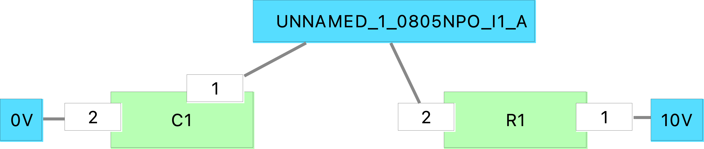
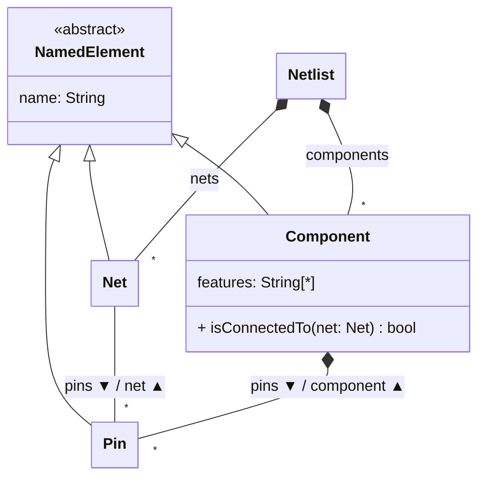

# EMC driver for Allegro Design Entry HDL concise netlists

This repository implements an [Eclipse Modeling Framework](http://eclipse.dev/emf) resource factory for the concise netlist export format (`dialcnet.dat`) produced by the Allegro Design Entry HDL tool by Cadence.

On top of this, the repository provides an [Epsilon Model Connectivity](https://eclipse.dev/epsilon/doc/emc/) driver that makes it more convenient to access such concise netlists from programs written in the [Eclipse Epsilon](https://eclipse.dev/epsilon/doc/emc/) model management languages.

This also makes it possible to take a concise netlist like the [example one](./examples/org.eclipse.epsilon.examples.netlist.model/dialcnet.dat) and use [Eclipse Sirius](https://eclipse.dev/sirius/) to visualise it like this:

*Note*: the resource factory and EMC driver only support reading netlists. Saving changes is not supported.

## Repository structure

* `bundles`: Eclipse plugins implementing the EMF resource factory, EMC driver, and tooling.
  * `o.e.e.netlist.model`: metamodel and EMF resource factory for concise netlists.
  * `o.e.e.emc.netlist`: EMC driver for concise netlists, based on the EMF EMC driver.
  * `o.e.e.emc.netlist.dt`: developer tooling for the EMC driver from within the Eclipse IDE.
  * `o.e.e.netlist.viewpoint`: Eclipse Sirius-based viewpoint over concise netlist models.
* `examples`:
  * `o.e.e.examples.netlist.model`: minimal example model shown above, with Sirius representations.
  * `o.e.e.examples.netlist.queries`: example EOL program querying concise netlists, together with sample Java code to execute it (using the generic EMF EMC driver, and using the netlist-specific variant).

## Metamodel

The metamodel implemented by this EMF driver is as follows:

The `isConnectedTo` method in `Component` can check if it's directly or indirectly connected to a `Net`.

It operates by doing a breadth-first traversal from both the `Component` and `Net` sides, iteratively expanding the traversal by one level on each side, until either both sides meet in the middle (connected), or no more nodes are left to visit (not connected).

## Usage

From an Eclipse IDE with Epsilon and Sirius installed:

* Import the plugins in the `bundles` folder.
* Right-click on any of the plugins and select "Run As - Eclipse Application".
* In the nested Eclipse instance, import the projects in the `examples` folder:
  * Try browsing the `.dat` model through the reflective EMF editor, and compare with the representations in the `.aird` file.
  * Run the example programs to see how to query these netlists through plain Java and through Epsilon programs.

## License

This repository is licensed under the [Eclipse Public License 2.0](./LICENSE).