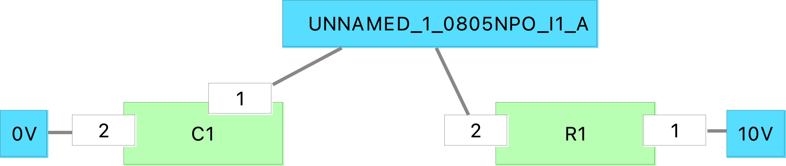
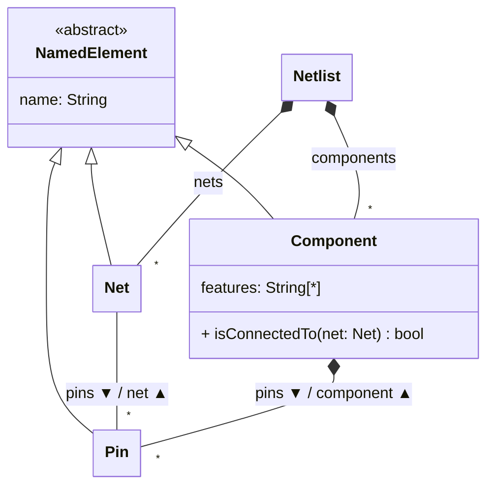
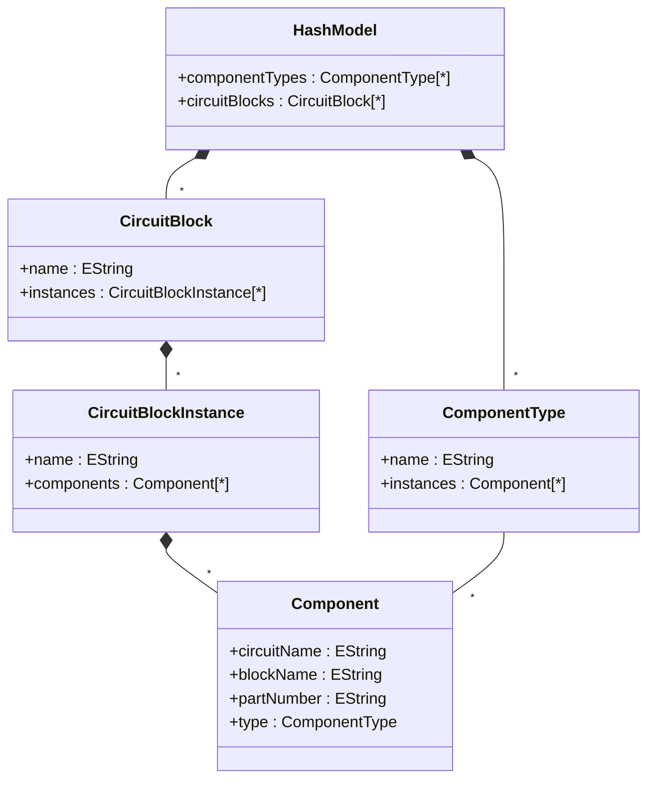
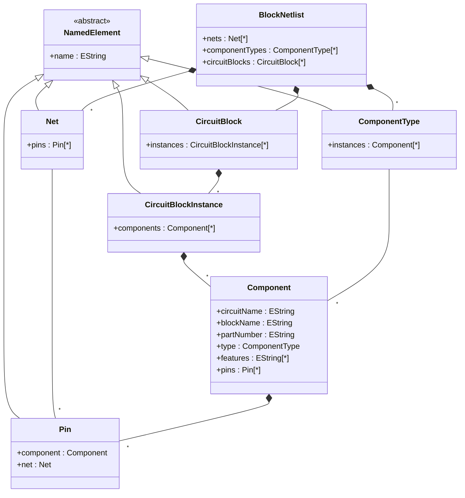

# EMC driver for Allegro Design Entry HDL concise netlists and hash files

This repository implements [Eclipse Modeling Framework](http://eclipse.dev/emf) resource factories for the following export formats produced by the Allegro Design Entry HDL tool by Cadence:

* Concise netlists (`dialcnet.dat`)
* Hash files (`*.hash`)

On top of this, the repository provides an [Epsilon Model Connectivity](https://eclipse.dev/epsilon/doc/emc/) driver for concise netlists, that makes them more convenient to access from programs written in the [Eclipse Epsilon](https://eclipse.dev/epsilon/doc/emc/) model management languages.

This also makes it possible to take a concise netlist like the [example one](./examples/org.eclipse.epsilon.examples.netlist.model/dialcnet.dat) and use [Eclipse Sirius](https://eclipse.dev/sirius/) to visualise it like this:



*Note*: the resource factory and EMC driver only support reading netlists. Saving changes is not supported.

## Repository structure

* `bundles`: Eclipse plugins implementing the EMF resource factories, EMC driver, and tooling.
  * `o.e.e.emc.netlist`: EMC driver for concise netlists, based on the EMF EMC driver.
  * `o.e.e.emc.netlist.dt`: developer tooling for the EMC driver from within the Eclipse IDE.
  * `o.e.e.netlist.cli`: command-line tool for merging concise netlists and hash files into blocknet models, for easier validation of circuit constraints.
  * `o.e.e.netlist.merge.blocknet`: model transformation that merges a concise netlist with a hash file into a blocket nmodel.
  * `o.e.e.netlist.merge.dt`: developer tooling for the merging model transformation from the Eclipse IDE.
  * `o.e.e.netlist.model.blocknet`: metamodel for blocknet models. The default XMI resource factory is used in this case.
  * `o.e.e.netlist.model.concise`: metamodel and EMF resource factory for concise netlists.
  * `o.e.e.netlist.model.hash`: metamodel and EMF resource factory for hash files (used to associate components to circuit blocks).
  * `o.e.e.netlist.viewpoint`: Eclipse Sirius-based viewpoint over concise netlists and blocknet models.
* `examples`:
  * `o.e.e.examples.netlist.model`: example models, including the minimal example model shown above, with Sirius representations.
  * `o.e.e.examples.netlist.queries`: example EOL program querying concise netlists, together with sample Java code to execute it (using the generic EMF EMC driver, and using the netlist-specific variant).
* `releng`:
  * `o.e.e.netlist.target`: target plaform to be used to compile, develop, and test the code in this repository. Requires having the M2Eclipse PDE integration installed.

## Metamodel (concise netlists)

The concise netlist metamodel implemented by this EMC driver is as follows:


```mermaid
---
  config:
    class:
      hideEmptyMembersBox: true
---
classDiagram
class Netlist {}
class NamedElement {
  <<abstract>>
  name: String
}
class Net {}
class Component {
  features: String[*]
  + isConnectedTo(net: Net) bool
}
class Pin {}

NamedElement <|-- Net
NamedElement <|-- Component
NamedElement <|-- Pin

Netlist *-- "*" Net : nets
Netlist *-- "*" Component : components

Net -- "*" Pin : pins ▼ / net ▲
Component *-- "*" Pin : pins ▼ / component ▲
```

The `isConnectedTo` method in `Component` can check if it's directly or indirectly connected to a `Net`.

It operates by doing a breadth-first traversal from both the `Component` and `Net` sides, iteratively expanding the traversal by one level on each side, until either both sides meet in the middle (connected), or no more nodes are left to visit (not connected).

## Metamodel (hash files)

The metamodel for hash files is as follows:


```mermaid
classDiagram
    class HashModel {
        +componentTypes : ComponentType[*]
        +circuitBlocks : CircuitBlock[*]
    }

    class ComponentType {
        +name : EString
        +instances : Component[*]
    }

    class CircuitBlock {
        +name : EString
        +instances : CircuitBlockInstance[*]
    }

    class CircuitBlockInstance {
        +name : EString
        +components : Component[*]
    }

    class Component {
        +circuitName : EString
        +blockName : EString
        +partNumber : EString
        +type : ComponentType
    }

    %% Relationships
    HashModel *-- "*" ComponentType
    HashModel *-- "*" CircuitBlock
    CircuitBlock *-- "*" CircuitBlockInstance
    CircuitBlockInstance *-- "*" Component
    ComponentType -- "*" Component
```

In hash files, there is a distinction between the abstract blocks (`CircuitBlock`) and the specific instances of that block (multiple copies of that block can exist in the same circuit).
For example, if there is an `ADC01` block, there could be four instances of that block (e.g. `A1` to `A4`): a capacitor `C1` in that block would therefore be expected to appear four times (e.g. `C1A1` for the instance in A1, `C1A2`, and so on).

In such a situation, `C1A1` would have `blockName` equal to "C1", and circuitName equal to "C1A1".

In addition, components are organised into types (e.g. CAP type for capacitors).
A component can also have a `partNumber` that relates it to the specific inventory part to be used (e.g. a specific resistor, with concrete component values).

## Metamodel (blocknets)

In some situations, we need to have both the connectivity information of netlists, and the block-based structure of hash files.
For this purpose, a new type of model has been created that integrates both (a *blocknet*).
Blocknet models conform to this metamodel:


```mermaid
classDiagram
    class BlockNetlist {
        +nets : Net[*]
        +componentTypes : ComponentType[*]
        +circuitBlocks : CircuitBlock[*]
    }

    class NamedElement {
        <<abstract>>
        +name : EString
    }

    class CircuitBlock {
        +instances : CircuitBlockInstance[*]
    }

    class ComponentType {
        +instances : Component[*]
    }

    class CircuitBlockInstance {
        +components : Component[*]
    }

    class Net {
        +pins : Pin[*]
    }

    class Pin {
        +component : Component
        +net : Net
    }

    class Component {
        +circuitName : EString
        +blockName : EString
        +partNumber : EString
        +type : ComponentType
        +features : EString[*]
        +pins : Pin[*]
    }

    %% Inheritance
    NamedElement <|-- CircuitBlock
    NamedElement <|-- ComponentType
    NamedElement <|-- CircuitBlockInstance
    NamedElement <|-- Net
    NamedElement <|-- Pin

    %% Composition and Associations
    BlockNetlist *-- "*" Net
    BlockNetlist *-- "*" ComponentType
    BlockNetlist *-- "*" CircuitBlock
    CircuitBlock *-- "*" CircuitBlockInstance
    CircuitBlockInstance *-- "*" Component
    ComponentType -- "*" Component
    Net -- "*" Pin
    Component *-- "*" Pin
```

The concepts are a union of the concise netlist and hash metamodels, so there is not much to explain here.
The only minor detail is that the features are expected to exclude the part number: for example, the merging transformation included in this repository will do that when merging the features from the concise netlist with the part number from the hash file.

## Building and running from sources

From an Eclipse IDE installation with the M2E PDE integration (e.g. an Eclipse Committers installation):

* Import the plugins in the `bundles` and `releng` folders.
* Open the `.target` file in `o.e.e.netlist.target`, wait for it to fully resolve, and select "Set as Target Platform".
* Right-click on any of the plugins and select "Run As - Eclipse Application".
* In the nested Eclipse instance, import the projects in the `examples` folder:
  * Try browsing the `.dat`, `.hash`, and `.blocknet` models through the reflective EMF editor, and compare with the representations in the `.aird` file.
  * You can select a `.dat` and a `.hash` file in the Project/Package/Model Explorer views, and then right-click on one of them to merge them into a blocknet model. The merged blocknet models make it easier to write programs that need both the connectivity and the block structure of the original circuit.
  * Run the example programs to see how to query these netlists through plain Java and through Epsilon programs.

You can also build the command-line tool, by right-clicking on the `o.e.e.netlist.cli` project and exporting it as a runnable JAR file via Eclipse, selecting its `Launcher` class as the main class.

## Using the command-line tool

There is a minimal command-line tool for merging concise netlists and hash files into blocknet models, which can be then used for model querying and validation.

To build the tool, follow the steps [above](#building-and-running-from-sources).
We will assume you exported it to a JAR file called `netlist-cli.jar`.
In this case, you can run this command to obtain help:

```shell
$ java -jar netlist-cli.jar --help
Usage: netlist-cli [-hV] [COMMAND]
  -h, --help      Show this help message and exit.
  -V, --version   Print version information and exit.
Commands:
  merge     Merges a .dat and a .hash file into a .blocknet file
  validate  Validates the provided .blocknet model against the given constraints
````

To merge a concise netlist and a hashfile into a blocknet model, you can run:

```shell
java -jar netlist-cli.jar merge a.dat b.hash c.blocknet
```

To validate a blocknet against a set of EVL rules, you can run:

```shell
java -jar netlist-cli.jar validate c.blocknet d.evl
```

## License

This repository is licensed under the [Eclipse Public License 2.0](./LICENSE).
